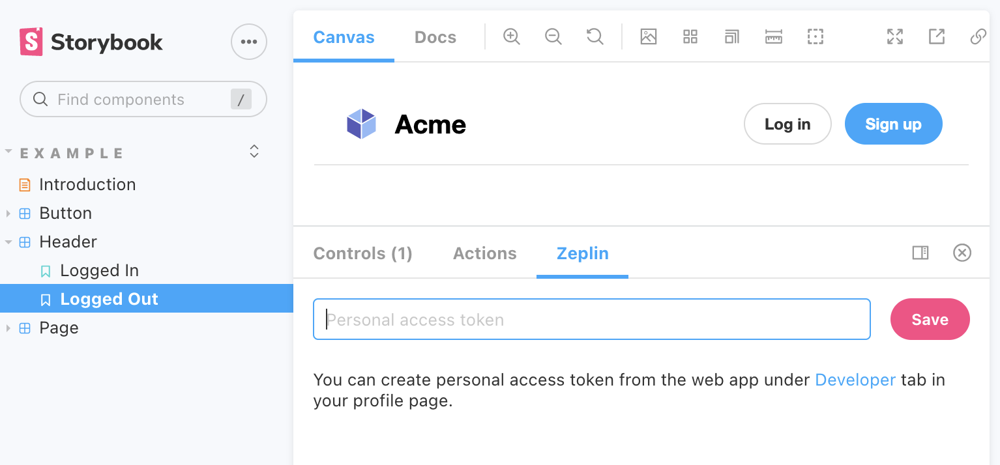

<div align="center">

  
  <br/>
  <br/>

[](https://badge.fury.io/js/storybook-zeplin)
[](https://www.npmjs.com/package/storybook-zeplin)
[](https://github.com/mertkahyaoglu/storybook-zeplin/blob/master/LICENSE)
[](https://app.netlify.com/sites/storybook-zeplin/deploys)
[](https://opencollective.com/storybook-zeplin)

</div>

<hr/>

## Storybook Zeplin addon

[Storybook](https://github.com/storybooks/storybook) addon that embeds Zeplin resources such as screens and components in the addon panel for better design-development workflow.

  

## Links

- [Demo](https://storybook-zeplin.netlify.app)
- [Blog Post](https://blog.zeplin.io/storybook-and-zeplin-a-new-integration-228951e336e9)
- [Highlight Components](https://blog.zeplin.io/announcing-improved-storybook-integration-highlight-components)

## Requirements

-   Storybook@>=5.0.0

This addon should work with any framework. If you find a case that the addon does not work, please open an issue.

## Getting started

### 1. Install

```sh
npm install --save-dev storybook-zeplin
# yarn add -D storybook-zeplin
```

### 2. Register the addon in `main.js`

```js
// .storybook/main.js
module.exports = {
    addons: ["storybook-zeplin/register"],
};
```

If you're using Storybook@5.0.x;

```js
// .storybook/addons.js
import "storybook-zeplin/register";
```

### 3. Add a Zeplin link to your story (Optional)
> Skip this step if you don't want to set up all components one by one.

Storybook Zeplin takes parameter `zeplinLink` as an array of elements containing a name and a link or just a string for the link.
For the link, you can use full web URL or app URI of Zeplin components/screens.

Example of adding Zeplin link to all stories in a file:

```jsx
export default {
    title: "Button",
    component: Button,
    parameters: {
        zeplinLink: "https://app.zeplin.io/project/5e7a6d478204d59183a1c76b/styleguide/components?coid=5eac833c5f1f2f1cb19f4f19",
    },
};

export const Default = () => <Button>Click me</Button>;
export const Secondary = () => <Button secondary>Click me</Button>;

Default.story = {
    name: "Primary Button",
};

Secondary.story = {
    name: "Secondary Button",
};
```

Example of adding multiple Zeplin links to a story:

```jsx
export default {
    title: "Button",
    component: Button,
};

export const Default = () => <Button>Click me</Button>;
export const Secondary = () => <Button secondary>Click me</Button>;

Default.story = {
    name: "Responsive Button",
    parameters: {
        zeplinLink: [
            {
                name: "Desktop",
                link: "zpl://components?pid=pid1&coid=coid1",
            },
            {
                name: "Tablet",
                link: "zpl://components?pid=pid1&coid=coid2",
            },
            {
                name: "Mobile",
                link: "zpl://components?pid=pid1&coid=coid3",
            },
        ],
    },
};
```

### 4. Add Zeplin project or styleguide link to your global story parameters
> You may skip this step if you set Zeplin links using the method on Step 3 

Add `zeplinLink` to `.storybook/preview.js` file. This value is a link to the project or styleguide that contains correspondent designs in Zeplin as shown below examples.

When this parameter is provided, you will automatically view Zeplin components linked to your stories using the Storybook integration on the addon panel. Check out the following links for to learn more about [how to initialize Storybook integration](https://support.zeplin.io/en/articles/5674596-connecting-your-storybook-instance-with-zeplin) and [how to link components to stories](https://support.zeplin.io/en/articles/5679812-linking-your-components-in-zeplin-with-stories-in-storybook).

Using a Zeplin web link
```js
//.storybook/preview.js
export const parameters = {
    zeplinLink: "https://app.zeplin.io/project/5e7a6d478204d59183a1c76b",
};
```

Using a Zeplin app link
```js
//.storybook/preview.js
export const parameters = {
    zeplinLink: "zpl://project?pid=61f164b064e363a52fbb295f",
};
```

### 5. Set Zeplin access token

To access your Zeplin resources, you need to provide an access token with your Zeplin account permissions.
You can create one from [Developer](https://app.zeplin.io/profile/developer) tab in your profile page.

The addon prompts to set the token when you open the addon's tab. This token is kept in the browser storage, so each user needs to create and set their own token to access Zeplin resources via Storybook.



#### (Optional) Setting the access token using environment variable

If you want to skip creating tokens for each user,
you can provide the access token as an environment variable called `STORYBOOK_ZEPLIN_TOKEN`.
You can create `.env` file in your project's root folder, or you can provide the environment variable as a command line parameter when building or dynamically running Storybook.

#### ⚠️ Disclaimer

**Please note that access token can be viewed by anyone with access to the Storybook instance if you set it using environment variable.
For security reasons, never use the environment variable, if the Storybook instance can be accessed by 3rd parties.**

```shell
# .env
STORYBOOK_ZEPLIN_TOKEN="eyJhbGciOiJIUzI1N.."
```

## Development

Run following commands in separate tabs to start development

```shell
npm run watch
npm run storybook
```

## Notes
- This addon extracts the Storybook data and sends to parent frame to make stories reachable from Zeplin apps. For more information: [Zeplin Storybook integration](https://zpl.io/article/storybook-integration)

## License

MIT © [Mert Kahyaoğlu](https://mert-kahyaoglu.com)
