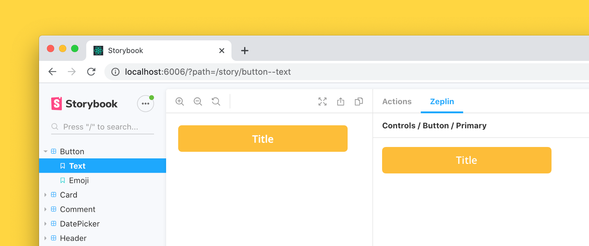

<div align="center">

  
  <br/>
  <br/>

[](https://badge.fury.io/js/storybook-zeplin)
[](https://www.npmjs.com/package/storybook-zeplin)
[](https://github.com/mertkahyaoglu/storybook-zeplin/blob/master/LICENSE)

</div>

<hr/>

## storybook-zeplin

[Storybook](https://github.com/storybooks/storybook) addon that embeds Zeplin resources such as screens and components in the addon panel for better design-development workflow.

  

### [Demo](https://storybook-zeplin.netlify.app)

## Requirements

-   Storybook@>=5.0.0

This addon should work with any framework. If you find a case that the addon does not work, please open an issue.

## Getting started

### 1. Install

```sh
npm install --save-dev storybook-zeplin
# yarn add -D storybook-zeplin
```

### 2. Add Zeplin access token to your environment variables

In order to access your Zeplin resources, you need to provide your access token. You can create one from https://app.zeplin.io/profile/developer.

```shell
# .env
STORYBOOK_ZEPLIN_TOKEN=<zeplin_token>
```

#### ⚠️ Disclaimer

Please note that this token can be accessed from client side. For security reasons, it would be safe to use this addon on localhost or internal network.

### 3. Register the addon in `main.js`

```js
// .storybook/main.js
module.exports = {
    addons: ["storybook-zeplin/register"],
};
```

If you're using Storybook@5.0.x;

```js
// .storybook/addons.js
import "storybook-zeplin/register";
```

### 4. Add a Zeplin link to your story

Storybook zeplin takes parameter `zeplinLink` as an array of elements containing a name and a link.
For the link, you can use full web URL or app URI of Zeplin components/screens.

Example of zeplin to all stories in a file:

```jsx
export default {
    title: "Button",
    component: Button,
    parameters: {
        zeplinLink: [
            {
                name: "Default",
                link: "https://app.zeplin.io/project/id",
            },
        ],
    },
};

export const Default = () => <Button>Click me</Button>;
export const Secondary = () => <Button secondary>Click me</Button>;

Default.story = {
    name: "Primary Button",
};

Secondary.story = {
    name: "Secondary Button",
};
```

Example of zeplin per story:

```jsx
export default {
    title: "Button",
    component: Button,
};

export const Default = () => <Button>Click me</Button>;
export const Secondary = () => <Button secondary>Click me</Button>;

Default.story = {
    name: "Primary Button",
    parameters: {
        zeplinLink: [
            {
                name: "Default",
                link: "https://app.zeplin.io/project/id",
            },
        ],
    },
};

Secondary.story = {
    name: "Secondary Button",
    parameters: {
        zeplinLink: [
            {
                name: "Desktop",
                link: "zpl://components?pid=componentid",
            },
            {
                name: "Tablet",
                link: "zpl://components?pid=componentid",
            },
            {
                name: "Mobile",
                link: "zpl://components?pid=componentid",
            },
        ],
    },
};
```

## Development

Run following commands in separate tabs to start development

```shell
npm run watch
npm run storybook
```

## License

MIT © [Mert Kahyaoğlu](https://mert-kahyaoglu.com)
