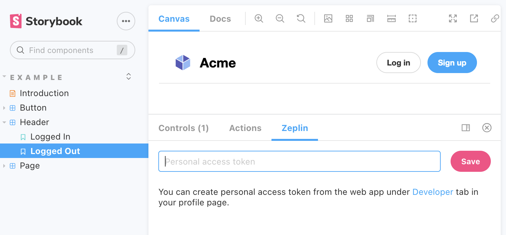

<div align="center">

  
  <br/>
  <br/>

[](https://badge.fury.io/js/storybook-zeplin)
[](https://www.npmjs.com/package/storybook-zeplin)
[](https://github.com/zeplin/storybook-zeplin/blob/master/LICENSE)
[](https://app.netlify.com/sites/storybook-zeplin/deploys)
[](https://opencollective.com/storybook-zeplin)

</div>

<hr/>

## Storybook Zeplin addon

[Storybook](https://storybook.js.org) addon that embeds Zeplin designs in the addon panel and overlays them on rendered components, so you can compare your implementation against the design.


## Links

- [Demo](https://storybook-zeplin.netlify.app)
- [Blog Post](https://blog.zeplin.io/storybook-and-zeplin-a-new-integration-228951e336e9)
- [Highlight Components](https://blog.zeplin.io/announcing-improved-storybook-integration-highlight-components)

## Requirements

Storybook Zeplin addon v4 is compatible with Storybook 10 and Node.js >=18.

For Storybook 8, use `storybook-zeplin@3`.

For Storybook 5-7, use `storybook-zeplin@2.0.3`.

## Getting started

### 1. Install

```sh
npm install --save-dev storybook-zeplin
# yarn add -D storybook-zeplin
```

### 2. Register the addon in `main.js`

```js
// .storybook/main.js
export default {
    addons: ["storybook-zeplin"],
};
```

### 3. Linking components

You can either link an entire Zeplin project or styleguide via global story parameters (recommended), or link individual components one by one.

#### Option A: Linking entire project or styleguide (Recommended)

Add `zeplinLink` to `.storybook/preview.js` with a link to the Zeplin project or styleguide that contains your designs.

Zeplin components linked to your stories will automatically appear in the addon panel.

Using a Zeplin web link

```js
//.storybook/preview.js
export const parameters = {
    zeplinLink: "https://app.zeplin.io/project/5e7a6d478204d59183a1c76b",
};
```

Using a Zeplin app link

```js
//.storybook/preview.js
export const parameters = {
    zeplinLink: "zpl://project?pid=61f164b064e363a52fbb295f",
};
```

Once the addon is set up, check out these articles to learn more about the Storybook integration on Zeplin:

- [Connecting your Storybook instance with Zeplin](https://support.zeplin.io/en/articles/5674596-connecting-your-storybook-instance-with-zeplin)
- [Linking your components in Zeplin with stories in Storybook](https://support.zeplin.io/en/articles/5679812-linking-your-components-in-zeplin-with-stories-in-storybook)

#### Option B: Linking individual stories manually

The `zeplinLink` parameter accepts either a string link or an array of `{ name, link }` objects. Links can be a full Zeplin web URL or an app URI pointing to a component or screen.

To link all stories in a file to the same Zeplin component:

```jsx
export default {
    title: "Button",
    component: Button,
    parameters: {
        zeplinLink:
            "https://app.zeplin.io/project/5e7a6d478204d59183a1c76b/styleguide/components?coid=5eac833c5f1f2f1cb19f4f19",
    },
};

export const Primary = {
    render: () => <Button>Click me</Button>,
};

export const Secondary = {
    render: () => <Button secondary>Click me</Button>,
};
```

To link a single story to multiple Zeplin components:

```jsx
export default {
    title: "Button",
    component: Button,
};

export const Responsive = {
    render: () => <Button>Click me</Button>,
    parameters: {
        zeplinLink: [
            { name: "Desktop", link: "zpl://components?pid=pid1&coid=coid1" },
            { name: "Tablet", link: "zpl://components?pid=pid1&coid=coid2" },
            { name: "Mobile", link: "zpl://components?pid=pid1&coid=coid3" },
        ],
    },
};
```

### 4. Set Zeplin access token

To access your Zeplin resources, provide an access token with your Zeplin account permissions. You can create one from the [Developer](https://app.zeplin.io/profile/developer) tab in your profile page.

The addon prompts for the token when you open the addon tab. The token is stored in the browser, so each user needs to create and set their own.



#### (Optional) Setting the access token via environment variable

To skip creating a token per user, provide it as `STORYBOOK_ZEPLIN_TOKEN` — either in a `.env` file in your project root, or as an environment variable when building or running Storybook.

#### ⚠️ Disclaimer

**When set via an environment variable, the access token is bundled into the Storybook build and can be read by anyone with access to the instance. Don't use this approach if your Storybook instance is accessible to third parties.**

```shell
# .env
STORYBOOK_ZEPLIN_TOKEN="eyJhbGciOiJIUzI1N.."
```

## Overlaying the design

Once a Zeplin design is loaded in the panel, click the eye icon to overlay it on top of the rendered component. Adjust opacity and scaling to align the two, lock the overlay in place once positioned, or toggle difference mode to highlight pixel-level mismatches.

You can drag the overlay with your mouse, or nudge it one pixel at a time with <kbd>Shift</kbd> + arrow keys.

## Development

Run the following commands in separate tabs to start development:

```shell
npm run watch
npm run storybook
```

## License

MIT © [Mert Kahyaoğlu](https://mert-kahyaoglu.com)
